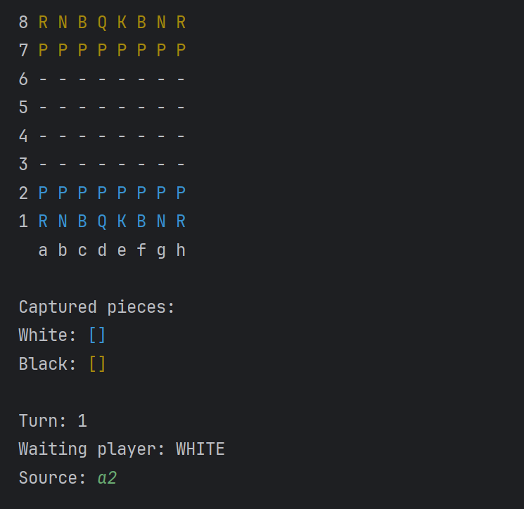

# Chess Game System♟️in Java

## Overview

This Chess Game System is a Java application designed to run in the terminal environment. It offers a simple yet engaging experience for playing chess, leveraging the power of Object-Oriented Programming (OOP) principles. With its intuitive interface and comprehensive functionality, it provides users with the opportunity to enjoy the classic game of chess right from their command line interface.

</br>
<div>
  
</div>
</br>

## Features
- Play chess against another player on the same computer.
- Supports all valid chess moves, including special moves like castling and en passant.
- User-friendly terminal interface for an easy gaming experience.

## How to Run
1. Clone the Repository: Clone this repository to your computer using the following command:
```
git clone https://github.com/Nyfeu/ChessGame_System.git
```
2. Navigate to the ChessGame_System directory;
3. Run the game with the following command:
```
java -classpath .\out\production\ChessGame_System\ application.Main
```
4. Play Chess: Follow the instructions displayed in the terminal to move the pieces and play chess.

